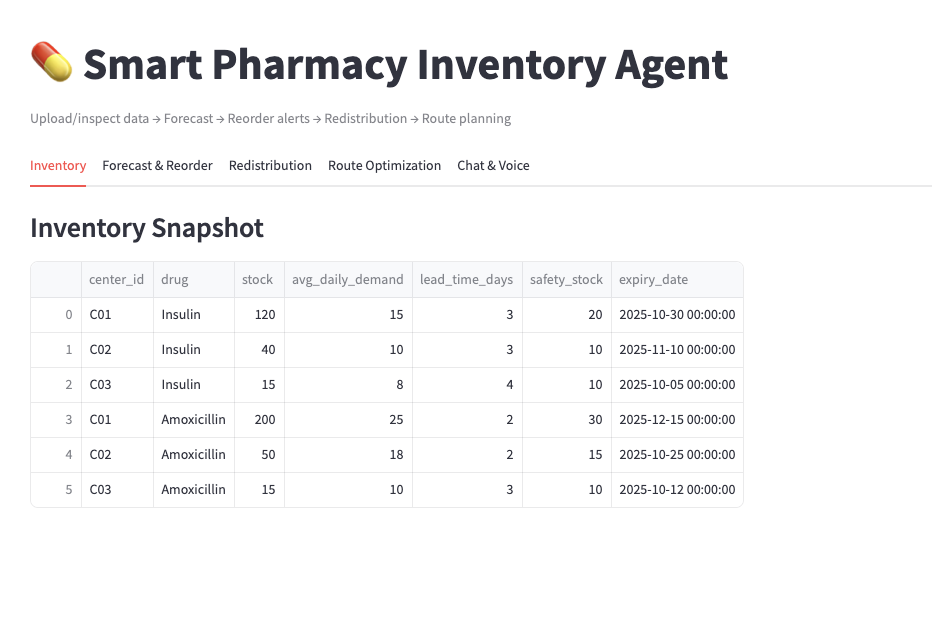
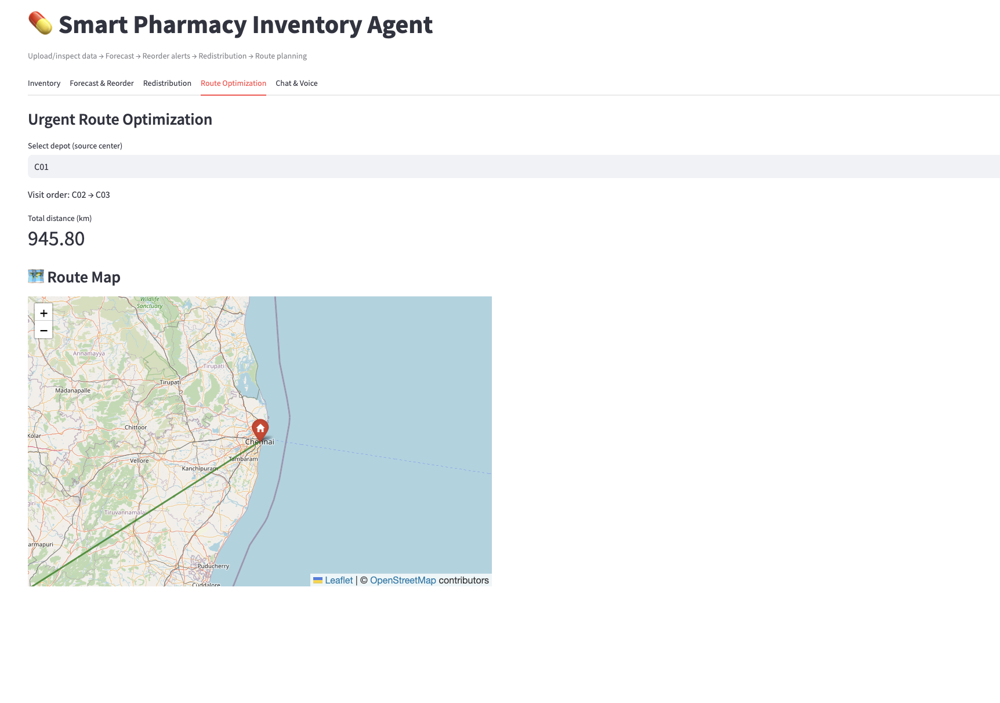

# Smart Pharmacy Inventory Agent

An end-to-end **prototype** to predict demand, prevent stockouts, reduce expiry waste, and optimize urgent routes for medicine replenishment.

## Features
- 📊 **Simple forecasting**: Exponential Moving Average + seasonality factor (day-of-week).
- 🔔 **Reorder suggestions**: Safety stock, lead time, and service level (z-score) based.
- 🔁 **Redistribution**: Move near-expiry stock to centers with predicted shortfall.
- 🗺️ **Route optimization**: Greedy nearest-neighbor for urgent multi-stop delivery.
- 🖥️ **Streamlit UI**: Dashboard to upload data, run forecasts, see alerts, and simulate routes.
- ⚙️ **FastAPI backend** (optional): Same logic as reusable services (used by Streamlit directly).

> This is a lightweight, offline-friendly baseline (no heavy ML). Swap the forecasting module with ARIMA/Prophet later if needed.

## Quickstart (All-in-One using Streamlit)
```bash
python -m venv .venv && source .venv/bin/activate  # (Windows: .venv\Scripts\activate)
pip install -r requirements.txt
streamlit run frontend/streamlit_app.py
```

## Data Schemas
- **data/sample_inventory.csv**: `center_id,drug,stock,avg_daily_demand,lead_time_days,safety_stock,expiry_date`
- **data/centers.csv**: `center_id,name,lat,lon`
- **data/demand_signals.csv**: `date,center_id,drug,qty` (historical sales/consumption)

> Replace with your real exports from pharmacy/HIS. Dates are ISO `YYYY-MM-DD`.

## Tests
```bash
pytest -q
```

### Testing Redistribution & Route Optimization
To test the end-to-end redistribution and route optimization features:

1. **Run the dedicated test script** (uses sample data, simple forecasts):
   ```bash
   cd smart-pharmacy-agent
   source .venv/bin/activate
   python backend/services/test_features.py
   ```
   Expected output: Suggested moves DataFrame, optimized route order, and total distance (e.g., ~1500 km with 5 centers).

2. **With Groq LLM forecasts** (uncomment the last line in test_features.py for advanced testing):
   - Ensure GROQ_API_KEY is set.
   - Rerun the script; it will use AI-generated forecasts for more dynamic results.

3. **In Streamlit UI**:
   - Run `streamlit run frontend/streamlit_app.py`.
   - Upload or use sample CSVs in the "Forecast & Reorder" tab.
   - Enable "Redistribution Simulation" to see moves and routes visualized.

This verifies expiry waste reduction and efficient delivery planning. Adjust expiry_days or horizon in test_features.py for custom scenarios.

## API (Optional)
Run FastAPI (if you prefer API mode):
```bash
uvicorn backend.main:app --reload
```


## 🔌 Groq Integration

This build can use **Groq LLM** for forecasting and explanations.

### Setup
1. Get an API key from Groq and set it in your environment (or a `.env` file in project root):
   ```bash
   export GROQ_API_KEY="your_key_here"
   export GROQ_MODEL="llama-3.1-8b-instant"  # optional
   ```
2. Install deps (already in requirements):
   ```bash
   pip install groq python-dotenv
   ```

### Use in Streamlit
- In the **Forecast & Reorder** tab, enable **"Use Groq LLM for forecasting"** (on by default).
<p align="center">
  
  <br>
  <em>Main Streamlit dashboard with tabs</em>
</p>

---

## UI Screenshots

<table>
  <tr>
    <td></td>
    <td></td>
  </tr>
  <tr>
    <td align="center"><em>📦 Inventory Snapshot</em></td>
    <td align="center"><em>📊 Forecast & Reorder</em></td>
  </tr>
  <tr>
    <td></td>
    <td></td>
  </tr>
  <tr>
    <td align="center"><em>♻️ Redistribution Moves</em></td>
    <td align="center"><em>🗺️ Route Optimization</em></td>
  </tr>
</table>

---

## Voice & AI Features

<p align="center">
  
  <br>
  <em>🎙️ Voice input and 🔊 TTS response</em>
</p>

<p align="center">
  
  <br>
  <em>🤖 Groq LLM-powered forecast explanations</em>
</p>

### API Endpoint
```
GET /forecast_groq?center_id=C01&drug=Insulin&horizon=7
```
